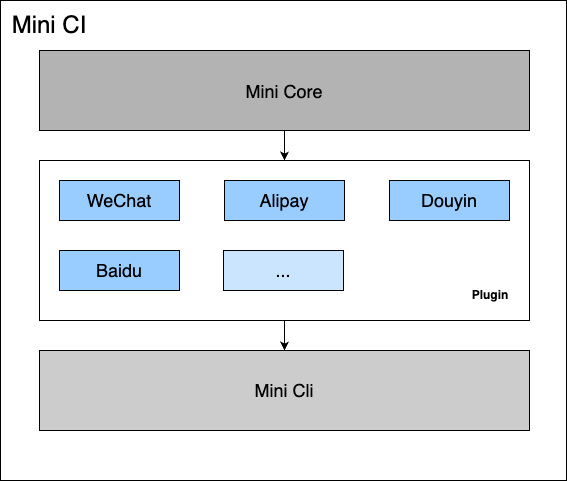
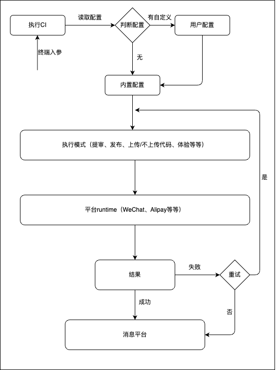

<div align="center">
  <h1>Mini CI</h1>

  <p>
    <a></a>
    <a></a>
    <a></a>
    <a></a>
    <a></a>
    <a></a>
  </p>
</div>

一款面向小程序多端开发的自动化提审、发版CI工具，技术基于NodeJS

## 起步
使用自己熟悉的npm包管理工具如：npm、yarn、pnpm等进行安装，支持局部或全局安装

### 安装

```shell
# 项目中安装
npm install @hengshuai/mini-ci -D

# 全局安装
npm install -g @hengshuai/mini-ci
```

### 配置
CI默认会读取项目下的`mini-ci.config.js`文件，以commonjs格式进行配置，最终会被node读取

```js
// mini-ci.config.js

module.exports = {
  // ...
}
```

### 运行

配置脚本
```package.json
"scripts": {
  "ci": "mini-ci start"
}
```

执行脚本
```shell
npm run ci
```

## 平台支持
不同平台以插件的形式进行开发，预期支持以下平台：

- [x] 微信
- [ ] 支付宝
- [ ] 抖音
- [ ] 百度
- 其他...

## 功能支持
相关功能正在开发中...

- [x] 代码上传
- [ ] 提审
- [ ] 发版
- [ ] 版本管理
- [ ] 多端同步
- [ ] 自定义步骤

## 架构与流程

<p align="center">架构图</p>


<p align="center">流程图</p>
